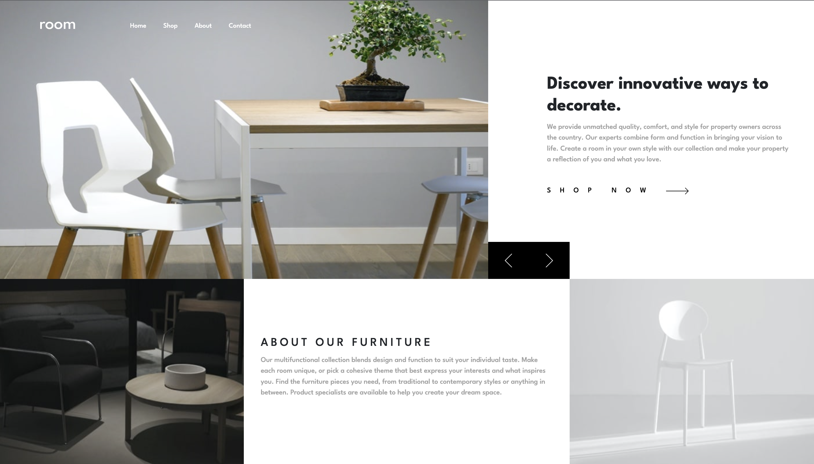

# Frontend Mentor - Room homepage solution

This is a solution to the [Room homepage challenge on Frontend Mentor](https://www.frontendmentor.io/challenges/room-homepage-BtdBY_ENq). Frontend Mentor challenges help you improve your coding skills by building realistic projects.

## Table of contents

- [Overview](#overview)
- [The challenge](#the-challenge)
- [Screenshot](#screenshot)
- [Links](#links)
- [My process](#my-process)
- [Built with](#built-with)
- [What I learned](#what-i-learned)
- [Author](#author)

**Note: Delete this note and update the table of contents based on what sections you keep.**

## Overview

### The challenge

Users should be able to:

- View the optimal layout for the site depending on their device's screen size
- See hover states for all interactive elements on the page
- Navigate the slider using either their mouse/trackpad or keyboard

### Screenshot

### Links

- Solution URL: [https://lucasalamelou.github.io/room-homepage/](https://lucasalamelou.github.io/room-homepage/)

## My process

### Built with

- Semantic HTML5 markup
- CSS custom properties
- Flexbox
- CSS Grid
- Mobile-first workflow
- Bootstrap 5

### What I learned

const timeline = gsap.timeline({ defaults: { ease: 'power1.out' } });

timeline.to('.intro\_\_text', { y: '0%', duration: 1, stagger: 0.25 });
timeline.to('.slider', { y: '-100%', duration: 1.5, delay: 0.5 });
timeline.to('.intro', { y: '-100%', duration: 1 }, '-=1');

function changeText() {
heroDescrption.classList.add('hero-description-transition');
setTimeout(function () {
heading.textContent = texts[index % texts.length].heading;
description.textContent = texts[index % texts.length].description;
heroDescrption.classList.remove('hero-description-transition');
}, 600);
}

## Author

- Website - [Alamelou Lucas](https://www.github.com/LucasAlamelou)
